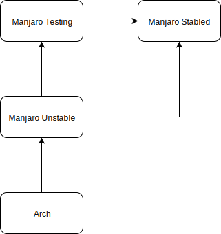
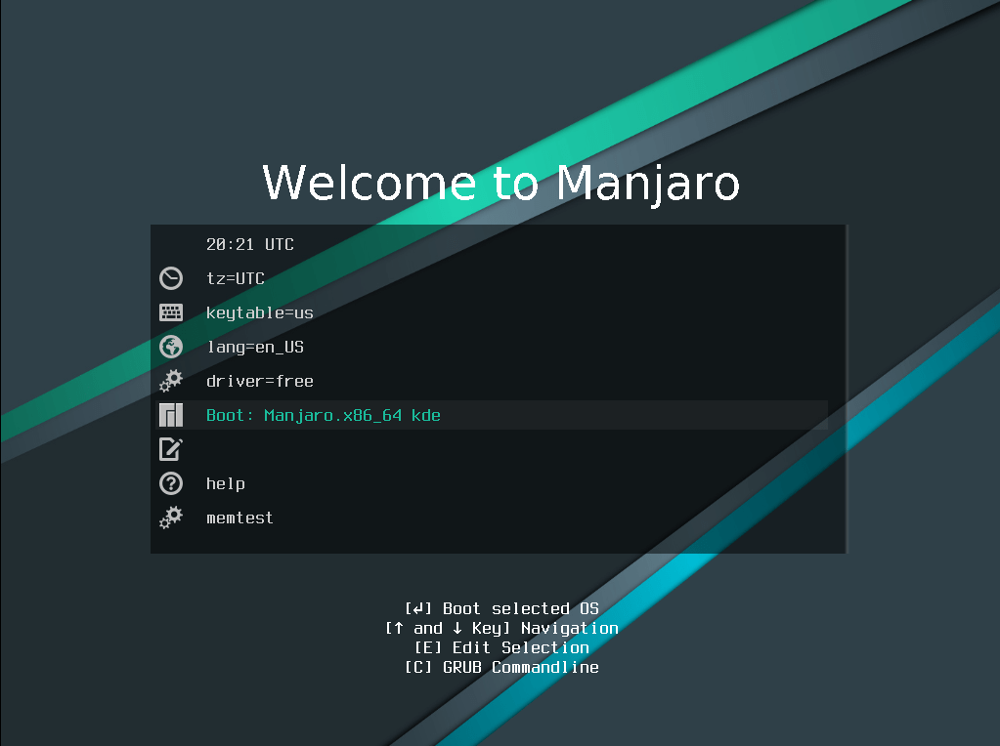
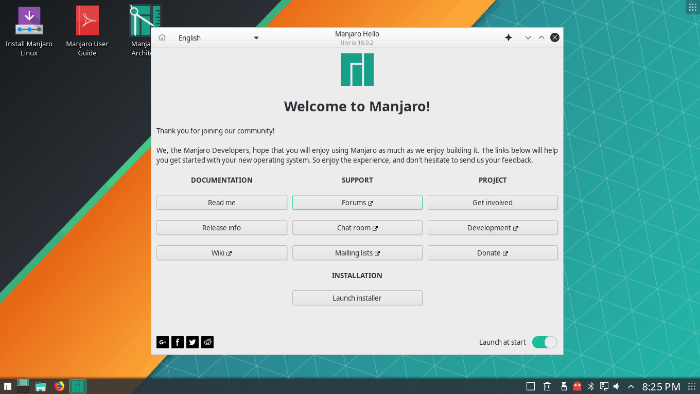
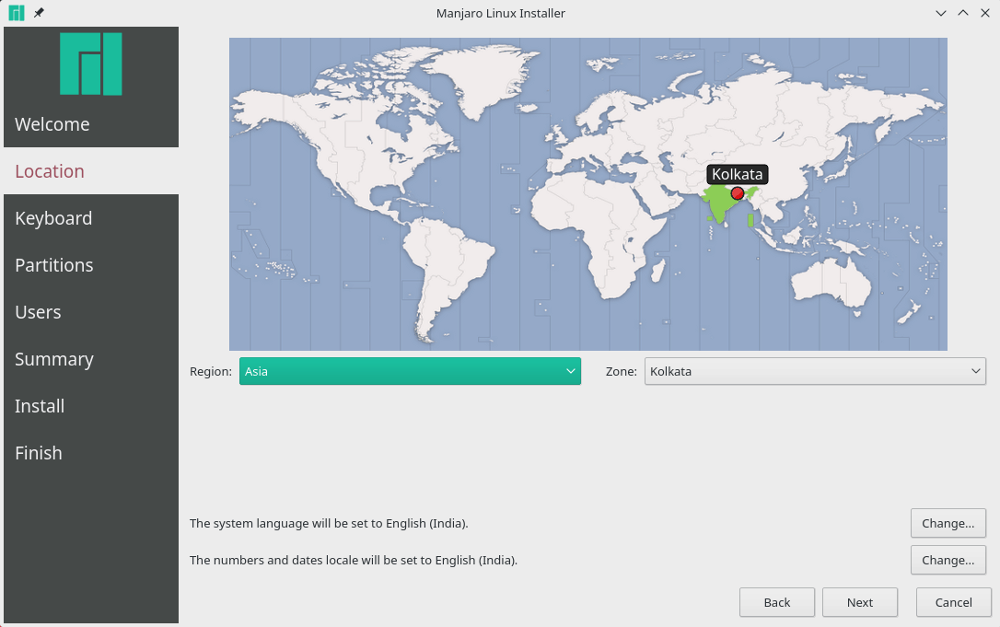
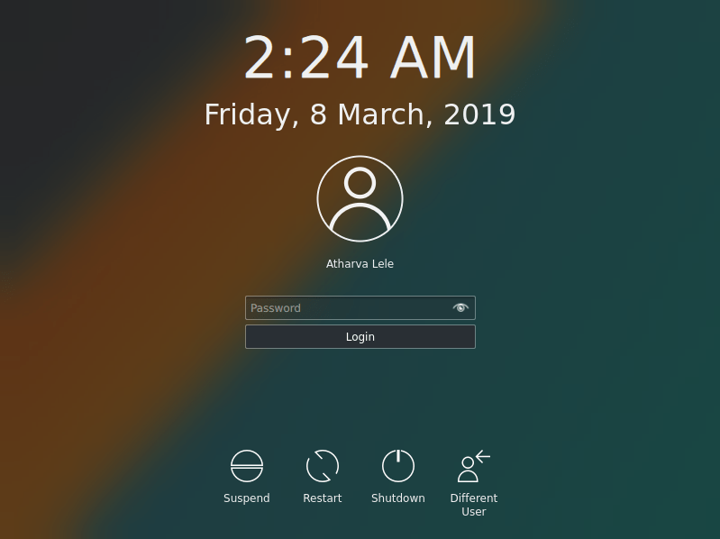

# Operating Systems
{: .no_toc }

## Table of contents
{: .no_toc .text-delta }

1. TOC
{:toc}

---

# Operating Systems

# Manjaro Linux

## Background 

[Why should you learn to use linux?]

A linux distribution or _'distro'_ is an operating system based on the [linux
kernel](https://en.wikipedia.org/wiki/Linux\_kernel). Linux distros comprise a
linux kernel, a window system, a window manager, and a desktop environment. We
will install Manjaro Linux, a distro based on [Arch
Linux](https://www.google.com/search?client=firefox-b-1-d&q=arch+linux).
Manjaro, like Arch, is built on a rolling release update model: rather than a
single large system update, releases are implemented using small, frequent
updates, only updating a piece of software that has been changed since the last
update. Manjaro follows arch development with an additional layer of testing:



We will use Manjaro because we are Arch fans, but Manjaro's \~6-week release
delay behind Arch makes it more stable and secure. Plus, it is easy to install.
We will install Manjaro with the _KDE Plasma_ desktop environment, which uses
the [X Window System](https://en.wikipedia.org/wiki/X\_Window\_System) for a
GUI ("graphical user interface") environment and the Dolphin file manager.

## Set up a bootable USB

If you've been provided with a bootable USB, skip to the 'Installation' section.

#### Option 1: with Etcher
Etcher is a tool that allows you to flash OS images (.iso files) to SD cards
and USB drives. It provides protection for corrupted cards and helps prevent
you from wiping your entire hard drive!

1. [Download Manjaro](https://manjaro.org/download/kde/) (KDE Plasma). The .iso
   file will take a while to download.
2. [Download Etcher](https://www.balena.io/etcher/) for your OS.
3. Run the application and walk through the GUI (graphical user interface) to
   select your thumb drive and .iso file.
4. Click "Flash" and wait for it to finish.

#### Option 2: with `dd`
This method performs a low level (ie binary) copy of the .iso file onto the
USB. In general, you want to be very careful when using `dd` because one letter
being incorrect could cause you entire hard drive to get erased. We do not
recommend using this method until you are a little more familiar with the Linux
ecosystem. However, reading through the instructions will provide some insight
into the mechanics of Etcher.

1. [Download](https://manjaro.org/download/kde/) Manjaro (KDE Plasma). The .iso
   file will take a while to download.
2. Plug a USB drive into your computer.
3. In a terminal, run `lsblk` to see which device corresponds to your USB by
   comparing the size of your usb to the size of the disks. The output will be
something like: 
```bash
$ lsblk
NAME   MAJ:MIN RM   SIZE RO TYPE MOUNTPOINT
sda      8:0    0 465.8G  0 disk 
├─sda1   8:1    0   200M  0 part /boot
├─sda2   8:2    0 139.6G  0 part 
└─sda3   8:3    0 325.9G  0 part /
sdb      8:16   1  14.9G  0 disk 
├─sdb1   8:17   1   1.6G  0 part /media/username/usb_volume_name
└─sdb2   8:18   1   2.4M  0 part 
sr0     11:0    1  1024M  0 rom  
```
In this case, my thumb drive is sdb. However, be very careful with this step
because yours could be different and a mistake with `dd` will destroy your
computer.

4. Make sure to unmount the drive before overwriting it:
```bash
sudo umount /dev/<?><?>
```
Where you will replace <?><?> with the mounted partiton. For me this will be sdb1,
but for you it could be different.

5. Finally, run this command to wipe the entire USB and replace it with the contents of the .iso
```bash
sudo dd bs=4M if=path/to/input.iso of=/dev/<?> status=progress
```
Here, you will replace <?> with the entire device. So for me this would be sdb.
Do not target a single partition on the device (ie sdb1) or it will not work.


See the [Arch
wiki](https://wiki.archlinux.org/index.php/USB_flash_installation_media#Using_dd)
for more information about both of these methods


## Installation
<!--The [boot loader](https://en.wikipedia.org/wiki/Booting#Modern_boot_loaders) is-->
<!--a small program in the computer's read-only memory (ROM) that loads the-->
<!--operating system to the computer's random-access memory (RAM).-->

1. Look up the method for booting from a USB that corresponds to your computer.
   The method you use will depend upon your hardware manufacturer as well as
   your software, but google is your friend. 
1. If your computer is powered on, power it off. 

1. Insert the bootable thumb drive

1. Follow the instructions you found to boot from the thumb drive.

1. Once you have successfully convinced your computer to boot off of the USB,
   Manjaro will load to ROM and a "Welcome to Manjaro" screen will appear that looks like this: 

Use the arrow keys to scroll to the "Boot: Manjaro.x86_64 kde" row and press
\<Enter\>.  While Manjaro boots, it will flash a log of all the processing being
started on your screen.

1. You are now on Manjaro! A "Welcome to Manjaro!" window will open
automatically. 

To begin installing it on your computer (remember, it has been
loaded to ROM from the USB, not from your computer's hard drive), click the
"Launch installer" button.

1. If you are not plugged into a power source, the installer will give you a
warning. I advise plugging your computer in. You will see another warning about
not being connected to the internet. Click the Wifi symbol near the
bottom-right of the status bar and enter your Wifi information.

1. Click "Next", and in the next two dialogs select your time zone information
and preferred keyboard layout.


1. On the next screen you will be presented with four options:
    - **Install alongside:** this will keep your current OS, but install
      Manjaro alongside it. This will allow you to boot into Manjaro _or_ your
current OS (but not both at the same time!).
    - **Replace a partition:** if your hard drive is already partitioned, you
      can choose which partition on which to install Manjaro
    - **Erase disk:** this will delete your current OS and replace it with
      Manjaro
    - **Manual partitioning:** if you know what you're doing, choose this
      option If you're unsure of what to select, choose 'Install alongside'.
    - Follow the prompts to resize the partitions (default is 50/50) and then
      click "Next".

1. Enter your name (this is just for the login screen).  

1. In the "What name do you want to use to log in?" box, enter a username. I
    like to keep this simple (I always use "g"), if only because it takes up
space in the console (more on this later).  

1. In the "What is the name of this computer?" box, choose a name for your
    computer. This can be whatever you want, but I like to keep it short for
the same reason as above (names I have used include "freddie" and "eliot").

1. Choose a password. Do not use the same password as your online accounts.
    You'll have to type this password a LOT, so I really recommend something
easy to type.  

1. Click the "Use the same password for the administrator account." box; this
    computer is for personal use, so you are the administrator.  Click "Next",
review the changes, and install!

1. Once the installation finishes, turn off your computer, unplug the USB and
    turn it back on. If all went well you'll be greeted with the Manjaro login
    screen:


Congrats, you just installed Linux!

## Configuration


## Wrap-up

There is a wealth of information about customization, configuration, and
troubleshooting at the [Manjaro
wiki](https://wiki.manjaro.org/index.php?title=Main_Page#Getting_Started).
