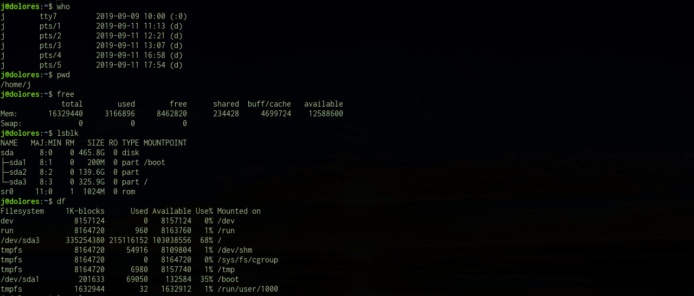
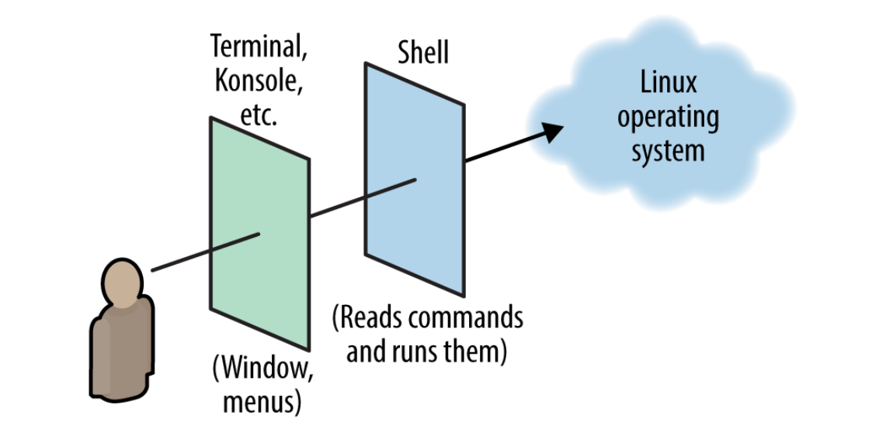
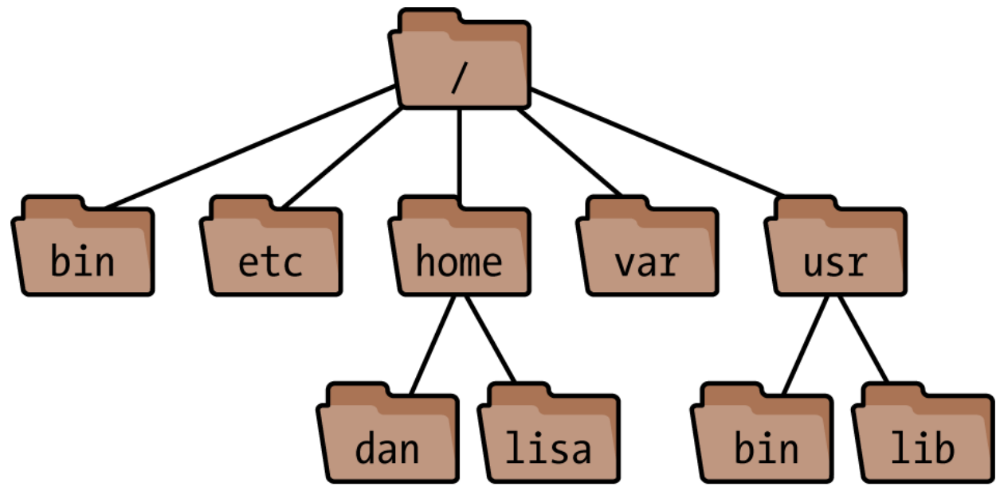

# Introduction to Linux
{: .no_toc }

## Table of contents
{: .no_toc .text-delta }

1. TOC
{:toc}

---

## Background

I can't overstate the importance of Linux. Without it, the modern internet
would not exist. Plus, it's really fun once you get the hang of it. Here's an
excerpt from William Shotts's book that has always resonated with me:

<blockquote>
<p>
    I want to tell you <b>a story</b>.
</p>
<p>
    No, not the story of how, in 1991, Linus Torvalds wrote the first version
    of the Linux kernel. You can read that story in lots of Linux books. Nor am I
    going to tell you the story of how, some years earlier, Richard Stallman began
    the GNU Project to create a free Unix- like operating system. That's an
    important story too, but most other Linux books have that one, as well.
</p>
<p>
    No, I want to tell you <b>the story of how you can take back control of your
    computer.</b>  When I began working with computers as a college student in the late
    1970s, there was a revolution going on. The invention of the microprocessor had
    made it possible for ordinary people like you and me to actually own a
    computer. It's hard for many people today to imagine what the world was like
    when only big business and big government ran all the computers. Let's just
    say, you couldn't get much done.
</p>
<p>
    Today, the world is very different. Computers are everywhere, from tiny wristwatches to
    giant data centers to everything in between. In addition to ubiquitous computers, we also
    have a ubiquitous network connecting them together. This has created a wondrous new
    age of personal empowerment and creative freedom, but over the last couple of decades
    something else has been happening. <b>A few giant corporations have been imposing their
    control over most of the world's computers and deciding what you can and cannot do
    with them.</b> Fortunately, people from all over the world are doing something about it. They
    are fighting to maintain control of their computers by writing their own software. They
    are building Linux.
</p>
<p>
    Many people speak of “freedom” with regard to Linux, but I don't think most
    people know what this freedom really means. <b>Freedom is the power to decide what
    your computer does, and the only way to have this freedom is to know what your
    computer is doing.</b> Freedom is a computer that is without secrets, one where
    everything can be known if you care enough to find out.
</p>
- <cite>William E. Shotts, Jr. - The Linux Command Line</cite>
</blockquote>

The Linux ecosystem consists of an incredibly wide range of tools. There are a
lot of resources by far more impressive teachers than us, so the goal of this
section is to pique your curiousity enough that you are inspired to do your own
investigation. The best introduction to linux that I have seen is [available
from
Amazon](https://www.amazon.com/gp/product/1491927577/ref=ox_sc_act_title_1?smid=ATVPDKIKX0DER&psc=1#reader_1491927577)
for $13.40. Buy it. If you learn everything in that book you'll be making
$60-$100K before long. But, if you really can't afford it then [Download the
PDF](/assets/books/Linux Pocket Guide, 3rd Edition.pdf) for now. But seriously,
buy the book.

## A First View

I don't think that I can do any better than Daniel Barret, so here are some of
the most important points from the beginning of his book. He starts by
describing the four main pieces that make up Linux:

>### The Kernel
>The low-level operating system, handling files, disks, networking, and other
>necessities we take for granted. Most users rarely notice the kernel.

>### Supplied Programs
>Thousands of programs for file manipulation, text editing, mathematics, web
>browsing, audio, video, computer programming, typesetting, encryption, DVD
>burning...you name it.

>### The Shell
>A user interface for typing commands, executing them,
>and displaying the results. Linux has various shells: the
>Bourne shell, Korn shell, C shell, and others. This book
>focuses on bash, the Bourne-Again Shell, which is often
>the default for user accounts. However, all these shells
>have similar basic functions.

>### X
>A graphical system that provides windows, menus, icons, mouse support, and
>other familiar GUI elements. More complex graphical environments are built on
>X; the most popular are KDE and GNOME. We’ll discuss only a few programs that
>open X windows to run.  This book focuses on the second and third parts:
>supplied programs and the shell.

> <cite>Daniel J. Barrett - Linux Pocket Guide</cite>

Out of these, you will typically interact most often with supplied programs and
the shell. We will focus primarily on learning the shell.

## The Shell

If you've ever seen a movie hacker, then you are already familiar with
what the shell looks like. Typically it will consist of a scrolling text output that looks
something like this:


**In order to harness the true power of linux, you need to master the shell.** It's
worth mentioning that you will not typically interact directly with the shell
but rather with a graphical emulator.

>
>The window program (Terminal, Konsole, etc.) is not the shell. It’s just a
>graphical program—possibly with fancy features of its own—that runs a shell on
>your behalf. The shell is what prompts you for commands and runs them.
>
> <cite>Daniel J. Barrett - Linux Pocket Guide</cite>

The shell has lots of nooks and crannies that allow you to move through it
efficiently. I have been using it every day for years and still regularly learn
something new. A careful read of the Pocket guide will provide you with lots of
worthy tidbits but here are a few to get you started: 

- You may use the up arrow or `ctrl+p` to access a previous command
- `ctrl+a` will move your cursor to the beginning of a line and `ctrl+e` will take you to the end
- Most commands support \<Tab\> completion to save you some typing
- Your shell configuration lives in a file named `.bashrc` inside your home directory

## Filesystem
Linux directories are organized in a tree structure, beginning with the "root"
directory. Directory paths are delineated by the slash symbol; since root is the
bottom-level directory of the tree, it is often referred to with a bare slash symbol: "/".

>Linux files are collected into directories. The directories form a hierarchy,
>or tree: 
>
>One directory may contain other directories, called subdirectories, which may
>themselves contain other files and subdirectories, and so on, into infinity.
>The topmost directory is called the root directory and is denoted by a slash 
>(/).
>
> <cite>Daniel J. Barrett - Linux Pocket Guide</cite>

#### Exercise: Visualize the File Tree 
1. Open up a terminal window. Konsole is installed by default
1. Install the `tree` package by typing `sudo pacman -S tree` and hitting enter
1. To see a visualization of the root directory tree, type `tree -L 1 /`
<br/>
<br/>
Bonus:
- Look up the shortcut for opening Konsole and use that instead of the start menu
- Pacman is Manjaro's package manager - type `man pacman` and read the section for `-S`
- `-L` limits the output to one level - try `tree -L 2 /`
- `/` indicates that we want to look at the root directory - try `tree -L 2 /home`
- try `tree -L 2 ~` - what directory does the `~` refer to?
{: .rounded}

### Absolute Paths

When a path begins from the root directory `/` - we say that path is **absolute**.

>We refer to files and directories using a “names and slashes” syntax called a
>path. For instance, this path:
>
>`/one/two/three/four`
>
>refers to the root directory /, which contains a directory called one, which
>contains a directory two, which contains a directory three, which contains a
>final file or directory, four. Any such path that begins with a slash, which
>descends all the way from the root, is called an absolute path.
>
> <cite>Daniel J. Barrett - Linux Pocket Guide</cite>

Most of the files you'll work with are in the `/home/$USER` directory.  Because
you end up typing the path you your home directory frequently, an "alias"
exists for it: `~`. 

The value of `$USER` depends upon the username of the person currently logged
in. In turn, the value of `~` depends upon the value of `$USER` and will always
point to the home directory of the current user.

### Relative Paths

Path that are not absolute are those relative to any directory other than the root.

>Any time you refer to a path that doesn’t begin with a slash, like bin, it’s
>called a relative path.
>
>To make sense of a relative path, you need to know “where you are” in the Linux
>filesystem. This location is called your current working directory (or just
>“current directory”). Every shell has a current working directory, and when you
>run commands in that shell, they operate relative to that directory. For
>example, if your shell is “in” the directory /usr, and you run a command that
>refers to a relative path bin, you’re really referring to /usr/bin. In
>general, if your current directory is /one/two/three, a relative path a/b/c
>would imply the absolute path /one/two/three/a/b/c.
>
> <cite>Daniel J. Barrett - Linux Pocket Guide</cite>

### Current Working Directory

You can see which directory you are in in the terminal prompt. The prompt
consists of your username, your computer's name, and your current directory:
```bash
[user@computer Desktop]$
```

or, if you are in your home directory:

```bash
[user@computer ~]$
```

That dollar sign is an indicator that the terminal is awaiting input This is a
line you can enter text into; lines containing responses will not have a `$`
prompt.

At this point, you may wonder, "Even if I know which folder I'm in, how do I
know where that folder is located?" To print your current filepath, use the
`pwd` ("print working directory") command. Try it in the terminal now. You
should see an output that looks like:

```bash
[user@computer ~]$ pwd
/home/user/Desktop
```

### Changing Directory

You can also change which directory you are in with the `cd` ("choose
directory") command. `cd` takes one argument: the directory you want to move
to. Try it:

```bash
$ cd /home
$ pwd
/home
```

You can use the \<Tab\> key to autocomplete this command (and most others) as
well. Try typing "cd /" into the command line and, before hitting \<Enter\>,
press \<Tab\> twice. All the directories inside the root directory should show
up.

```bash
$ cd /<Tab><Tab>
bin/        dev/        home/       lib64/      mnt/        proc/       run/
srv/        sys/        usr/        boot/       etc/        lib/
lost+found/ opt/        root/       sbin/       swapfile    tmp/        var/        
```

Continue by typing the letter "h" and pressing \<Tab\> again:

```bash
$ cd /h<Tab>
```

Notice that, since the `/home` directory is the only folder starting with "h",
the terminal autocompletes the command:

```bash
$ cd /home/
```

Press \<Enter\> and you will find yourself back in your home directory (check
to make sure with `pwd`!). Next, let's try using `cd` with a relative path. You
can tell that it is a relative path because it does not begin with a `/`

```bash
$ pwd
/home
$ cd user/Downloads
$ pwd
/home/user/Downloads
```

Another way to get back to your home directory is to type `cd ~`. An even
easier alias is simply `cd`, with no extra arguments, which does the same
thing.

## Basic File Operations

The pocket guide has a particularly excellent introduction to basic file
operations. Here are the most important ones:

```
ls          --      List files in a directory.
cp          --      Copy a file.
mv          --      Rename (“move”) a file.
rm          --      Delete (“remove”) a file.
ln          --      Create links (alternative names) to a file.
touch       --      Create a file
```

Take a moment now to **read pages 47-52 in the pocket guide**. These pages will help you
immensely with the following exercise.

#### Exercise: Learn Basic File Operations

1. Install the `tldr` package. It will provide you with easy to read documentation
1. Try `tldr ls` to see its usage
{: .rounded}
---
1. Create a file `foo.txt`
1. Rename the file `bar.txt`
1. Remove the file  
1. Create two new files (with one command) `foo.txt` and `bar.txt`
1. Remove both files (with one command)
{: .rounded}
---
1. Create a file in your `Downloads` directory called `foo.txt`
1. Move it into your home directory using absolute paths
1. Move it into your `Documents` directory using relative paths
1. Remove the file
1. Why might we prefer relative paths to absolute paths?  
1. List the contents of `/usr/bin` without moving into it
1. List the contents of `/usr/bin` using a relative path to it (hint: `../`)  
1. Why might we prefer absolute paths to relative paths?  
{: .rounded}
---
1. Create a file `foo.txt` and write `i am foo.txt` inside of it
1. Create a hard link from `bar.txt` to `foo.txt`
1. Check the contents of `bar.txt` (hint `tldr cat`)
1. Remove `foo.txt`
1. Check the contents of `bar.txt`
1. Create a hard link from `bar.txt` to `newfoo.txt`
1. Check the contents of `newfoo.txt`
1. Remove `bar.txt`
1. Check the contents of `newfoo.txt`
1. Remove `newfoo.txt`
1. What is the difference between soft links and hard links?  
{: .rounded}
---
1. Create `foo.txt`
1. Move it into your `Downloads` directory
1. List the contents of that directory
1. Copy it into `~`
1. List the contents of that directory
1. Remove both files with one command
{: .rounded}

## Basic Directory Operations
These are very similar to the previous commands, except that instead of
operating on files, they operate on directories:

```
cd          --      Change your current directory (i.e., “where you are now” in the filesystem).
pwd         --      Print the name of your current directory.
basename    --      Print the final part of a file path.
dirname     --      Print a file path without its final part.
mkdir       --      Create (make) a directory.
rmdir       --      Delete (remove) an empty directory.
rm -r       --      Delete a nonempty directory and its contents.
```

**Read pages 52-55 in the pocket guide**.

#### Exercise: Learn Basic Directory Operations

1. List your current working directory
1. Move into your `Downloads` directory
1. List your current working directory
1. Move into your home directory using aliases
1. Move into your root directory
1. Move into your `bin` directory and list the contents
1. Move into your home directory using relative paths
1. Why are aliases cool?
{: .rounded}
---
1. Make a new directory called `My Directory` using `mkdir My Directory`
1. Move into it using `cd My Directory`
1. What happened?
1. Why might you want to avoid spaces in directory / file names?
1. What are two ways that you could alter the above commands to make them work?
{: .rounded}
---
1. Make a new directory called `foo`
1. Make a directory inside `foo` called `bar`
1. Add a file to `foo/bar` called `foo.txt`
1. Remove `foo` using `rmdir`
1. What happened?
1. Remove `foo` using `rm -r`
1. Why might this be dangerous?
{: .rounded}
---
1. Make a new directory `bar` inside a directory `foo` with one command (hint `-p`)
1. Add a file to `foo/bar` called `foo.txt`
1. Move `foo` into your current working directory
{: .rounded}
---
1. When might you use the basename command?
{: .rounded}

## Ranger: A Better Way to Manage Files

Now, this is where the fun starts. There is a much more efficient way to handle
all of the operations we just learned. But, before you watch this video you need to
do two things:

1. Please please please ensure that you are proficient with the commands presented above
1. Install `ranger`
1. Add this into the bottom of your ~/.bashrc (hint use `nano ~/.bashrc` to edit your .bashrc): 
```bash
alias ranger='ranger --choosedir=$HOME/rangerdir; LASTDIR=`cat $HOME/rangerdir`; cd "$LASTDIR"'
```
This allows you to use ranger in order to change from one directory to another.


Once you have done those things, follow along with this video and try doing
some basic file / directory operations in ranger. Pretty rad, isn't it?

<iframe  title="YouTube video player" width="100%" height="400px" src="https://www.youtube.com/embed/L6Vu7WPkoJo" frameborder="0" allowfullscreen></iframe>

There is almost always an amazing CLI (command line interface) tool to make
your life easier. Take some time to play around with ranger, it's incredibly
customizable.


## Wrap Up
The linux command line can seem complex and scary at first. Trust me that it
will quickly seem intuitive and simple; once you grasp some basic concepts, you
will be able to use the shell effectively and continue learning on your own. 

<!--## Bash Quickstart-->
<!--Bash is a Unix command language, used as the default login shell-->
<!--(or command-line interpreter) for most Linux distros. Bash processes commands-->
<!--in a text window and can also execute commands from a file (a 'shell script'). -->
<!--Although you may never need to be a bash wizard, having a working relationship-->
<!--with the language is a prerequisite to becoming an effective developer. Bash is-->
<!--not necessarily a replacement for GUI tools, but in many cases it is much more-->
<!--useful (indeed, it can be the only available tool) for a given application.-->

<!--Bash is a scripting language in its own right, but the term "bash" is often-->
<!--used interchangeably to refer to command-line tools and to the language itself.-->
<!--The key point is that both bash and command-line tools are interpreted by the-->
<!--terminal.-->

<!--Another important command is ls, or "list". This will display the files in-->
<!--your current directory. Try it now:-->

<!--```bash-->
<!--$ ls-->
<!--Desktop  Downloads  Pictures   Documents-->
<!--```-->

<!--Most commands in bash can take "flags", which will change their output. `ls`,-->
<!--for example, can take the -a flag, which will show hidden files, or the -l-->
<!--flag, which will show ownership, permissions, and the modification date of-->
<!--files (more on this later). For example:-->

<!--```bash-->
<!--$ ls -l-->
<!--drwxr-xr-x  25 g g  4096 Sep  9 10:52  Desktop-->
<!--drwxr-xr-x  11 g g  4096 Jul 18 11:49  Documents-->
<!--drwx------   3 g g  4096 Sep 10 12:15  Downloads-->

<!--$ ls -a-->
<!--.  ..  .bash_aliases  .bash_history  .bash_profile  .bashrc  Desktop  Documents-->
<!--Downloads  Pictures  .xinitrc-->
<!--```-->

<!--Whoa, where'd all those files come from? In bash, a `.` before a file indicates-->
<!--that it is a "hidden" file. (If you're not seeing these files, enter `cd` into-->
<!--the command line to go back to your home directory, then try `ls -a`-->
<!--again.) These files are often used to store configuration-->
<!--data or scripts. We can use `ls` to show only the files we're interested in;-->
<!--let's see what the ".bash" files are all about.-->

<!--```bash-->
<!--$ ls -a .bash*-->
<!--.bash_aliases  .bash_history  .bash_profile  .bashrc-->
<!--```-->

<!--(Note that the asterisk serves as a "wildcard" in bash; in the command above,-->
<!--`ls` matched any filename beginning with the ".bash" string.)-->

<!--These are the configuration files for bash itself, and are often referred to as-->
<!--"dotfiles".  Each of these files is a valid [shell-->
<!--script](https://en.wikipedia.org/wiki/Shell_script). The most "important" one-->
<!--is your `.bashrc`. Bash runs this script every time you start a new terminal-->
<!--session. Thus, it can be incredibly useful for configuring your system. We will-->
<!--do this a little later in the "Text Editors" lesson. For the moment, to see-->
<!--what is in that file, we can use the `cat` command. `cat` prints all the text-->
<!--in a file. Type `cat .bashrc` into you terminal, press \<Enter\>, and see what-->
<!--happens!-->

<!--This output was pretty hard to read. How can we get a better sense of what's-->
<!--going on? One useful too for the job is called `grep`. `grep` does a _lot_, but-->
<!--it is basically a pattern matching tool. We can use `grep` to print only the-->
<!--lines in .bashrc that contain a specific pattern, such as "example". But how-->
<!--can we do this?-->

<!--First, we have to take a small detour. Note that up to this point, we have-->
<!--given the terminal an input and recieved an output. Where does that output go?-->
<!--Well, so far, it has been printed to the terminal, and that's it. What if we-->
<!--wanted to save that output somewhere? It turns out, this is pretty easy in-->
<!--bash. Let's first try to `cat` the output of a file that doesn't exist (follow-->
<!--along in the terminal):-->

<!--```bash-->
<!--$ cat foo.txt-->
<!--cat: foo.txt: No such file or directory-->
<!--```-->

<!--Good, we know that there is no text file called "foo.txt". Next, let's save -->

<!--Here we must introduce the "pipe" operator, denoted by the `|` symbol.-->

<!--All files that start with "bash" are run every time the system-->
<!--starts up, or any time you open a new terminal window. Thus, you can add-->
<!--configurations to any dotfile and it will work; the different files are there-->
<!--so you don't get confused.-->

<!--Although this lesson only briefly touches on more complex tools, it is worth-->
<!--familiarizing yourself with `sed`, `grep`, `awk`, and other standard bash-->
<!--tools.-->


<!--## Permissions-->

<!--## SSH -->
