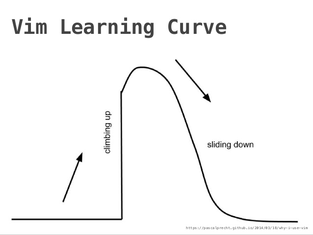

# Editing Code
{: .no_toc }

## Table of contents
{: .no_toc .text-delta }

1. TOC
{:toc}

---

## Text Editors

Text editors are where you will spend the majority of your time as a
programmer. Whether you are going to edit a configuration file, write a Bash
script, or just take a note, you need a place to do it.

Writing code is a little different than writing an essay. When you are writing
code, you will only spend a small portion of your time actually "writing". The
rest of the time is spent running code, moving blocks of it around, and running
it again. Text editors give you a very powerful set of tools for optimizing
this process.

Truthfully, the only text editor that matters is Vim (a lot of people would
disagree with me). It has a steep learning curve, but will radically change the
way that you write code:



Once you know Vim, you can edit code as fast as you can think.

It is important to learn a little bit of Vim because it is ubiquitous. Someday,
you will find yourself editing a file on a server that doesn't have a graphical
interface. But, the server will have Vim.

That said, it's a tool that is best learned in small bites so after learning
the basics we suggest using Visual Studio Code while reading about /
customizing your vim install on your spare time.

To get started with Vim, install it with pacman. Once that finishes, open up a
terminal and type:

```bash
vimtutor
```

Take your time with this tutorial and avoid using the arrow keys to navigate
through it. It takes a while to develop the muscle memory for hjk and l, but it
will help prevent carpal tunnel in the long run.

Once you are finished working through the tutorial, consider installing pacvim:

```bash
yay pacvim
```

And playing a few games per day (\$,G,gg, and 0 will be especially useful).
Alternatively, if you prefer a graphical interface check out [Vim
Adventures](https://vim-adventures.com/) and talk to the instructors about
acquiring the full version once you complete the free trial.

If you decide to pursue Vim as a primary development environment, check out the
resources page for some tips on customizations. Also, you should probably use
NeoVim over vim, it is much more modern and things seem to work a lot better
with less configuration.

## Integrated Development Environments (IDEs)

Most people these days prefer to write code in an IDE. Although it is possible
to configure Vim to function as an IDE, it takes a lot of time to get it just
right. IDE's provide things like autocompletion, linting, debugging, version control,
and doc access right out of the box.

The most popular IDE right now is probably Visual Studio Code. It was developed
by Microsoft and has a rich ecosystem of extensions to give it added functionality.
To get started, you can install it with pacman:

```bash
    sudo pacman -S code
```

This course will not cover a full configuration of VSCode because we want you
to customize it in a way that makes sense to YOU. That said,
[here](https://code.visualstudio.com/Docs) is a great page to get started.

Take some time to learn shortcuts and configure the IDE to your liking. There
are lots of getting started videos that might be helpful. At a minimum you
should have:

- Syntax highlighting
- A linter (like eslint)
- The ability to run code without moving your fingers off of the keyboard
- Autocompletion

Optionally, you could set up:

- A Vim plugin to make VSCode more powerful
- Snippets to save you some typing

#### Exercise: JavaScript 'Hello World' in VSCode
1. Install the javascript extension
{: .rounded}
