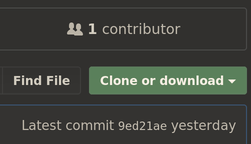

# Git
{: .no_toc }

## Table of contents
{: .no_toc .text-delta }

1. TOC
{:toc}

---

## Background

### Why version control?

Version control software is a collection of tools to enable an individual or
team to manage changes in a codebase over time. It tracks modifications to code
and allows develoeprs to fix mistakes by comparing changes over time. It also
enables collaboration by distributing the code among all users' computers and
providing a means of integrating work being done by different developers at the
same time. It is absolutely critical to use version control in developing
software; doing without it is difficult, risky, and a lot less fun.

### What is Git?

Git is the de facto standard for version control systems. It was developed in
2005 by Linus Torvalds, the creator of the Linux kernel. In Git, every
developer has a working copy of the code (the "repository") with a full history
of changes.


### Basic Usage
Git can be accessed from the command line with the `git` command. You may also
use a [Git GUI](https://git-scm.com/download/gui/windows) to interact with git.
This tutorial will take the command-line route; a Git GUI can be very useful
for unraveling complicated version histories, but starting with the command
line will give you strong fundamentals. If you would like to use a GUI, I
recommend [Gitkraken](https://www.gitkraken.com/) (paid with free tier) or
[ungit](https://github.com/FredrikNoren/ungit) (free).

We will be using [GitHub](https://github.com) for all of our work. Github
provides hosting for git repositories, improving collaboration and
communication. This is often referred to as the "remote" repository, and is a
copy of your work that lives on GitHub's servers. 

#### Exercise: Make an Account on GitHub
1. Go to [GitHub](https://github.com/). Sign up for an account.
1. Choose a reasonably professional username; this will be your public
   portfolio of work, as well as the place you collaborate with friends,
colleagues, and strangers. I am "gegnew" and Johnny is "jpribyl".
1. Upload a profile photo. It doesn't have to be of you, but this is a tryhard
   2k20 move that I recommend for no real reason.
1. Nice job.
{: .rounded}
---

## Set Up a Repository

### Creating a New Repository
Making a new repository ("repo") is easy: `git init` will create a `.git`
subdirectory in your current working directory and also create a new master
branch. You can also create a new project in a new repo by passing a new
project name, such as `git init new-project`. This will create a new repo in a
"new-project" folder.

#### Create a New Repo and Configure Git
1. Open a terminal window. Create a new directory called "FirstGit" and `cd`
   into it.

2. Run `git init`.

3. Look at the new files created with `ls -a` or by opening `ranger` and
   pressing "zh" to show hidden files. You should see a `.git` directory with
several files and folders inside it, but not much else. Press `q` when your
curiosity is satisfied.

4. Make sure you are in your "FirstGit" directory. The first time you use git
   from the command line, you need to log in. Do this with:

```
$ git config --global user.name "your username"
$ git config --global user.email "your email"
```

This configures git on your computer to use your GitHub account as the remote
repository. For aesthetic reasons, you can make git return colored output in
the terminal with:

```
$ git config --global color.ui true
```

#### Detour: Configure SSH

Next, we need to configure ssh. To check if you have any ssh keys already
   generated, type:

```
$ ls -la ~/.ssh
```

You should get a "No such file or directory" error.

1. To generate a new ssh key:
```
$ ssh-keygen -t rsa -b 4096 -C "your email"
```
2. When prompted to "Enter a file in which to save the key", accept the
   default location by pressing \<Enter\>.
3. When prompted, enter a password. Use something you'll remember.
4. Start the ssh agent in the background:
```
$ eval "$(ssh-agent -s)"
Agent pid 12543
```
5. Add the ssh private key you generated to the ssh-agent. If you used a
   different name for your key, or you are adding an existing key to the
   agent, replace "id_rsa" with the name you're using
```
$ ssh-add ~/.ssh/id_rsa
```

Last, add the key to your GitHub account. This will allow GitHub and your
computer to pass encrypted information without requiring your password each
time you push changes to GitHub.

1. SSH keys have a public and a private key. `id_rsa` is your private key, and the
corresponding public key is `id_rsa.pub`. Copy the public key to your clipboard.
Do this by opening the file (at `~/.ssh/id_rsa.pub`) in a text editor and
copying it or by using xclip:

```
$ pacman -S xclip
# Downloads xclip if you don't already have it
$ xclip -sel clip < ~/.ssh/id_rsa.pub
# Copies the contents of id_rsa.pub to your clipboard
```

2. Go to github.com and log in. Click your profile photo and then the
   *Settings* button.


3. Click *SSH and GPG keys*.


4. Click *Add SSH key*.


5. Title your ssh key with the name of your computer (or another descriptor
   to indicate which computer this is tied to). Then paste your key into
   the "Key" field. If the wrong text pastes, rerun the `xclip` command from
   earlier and try again.


6. Click *Add SSH key* and enter your password if prompted.

7. Test it by running:
```
$ ssh -T git@github.com
```

If you've been successful, you will get a response like:
```
Hi <username>! You've successfully authenticated, but GitHub does
not provide shell access.
```

Let's continue by pushing your "FirstGit" project to GitHub. Try running the
`git push` command.

You will get an error for "No configured push destination." You need to tell
your repository where it's remote should be located. Do this with:

To commit, you have to  make some changes. Make a blank file called "foo.txt"
and commit it:

```
$ touch foo.txt
$ git commit -m "initial commit"
```

Go to your GitHub dashboard and click the "New" button to create a new
repository. Name it "FirstGit". Make it public or private (whatever you prefer)
but don't click the "Initialize this repository with a README" option. Click
"Create repository".

Copy the url from the "Quick setup" window and run it with `git remote add`:

```
git remote add origin git@github.com:username/repositoryname.git
```

Replace "repositoryname" with "FirstGit" and "username" with your username.
This command adds a remote server (`remote add`) named `origin` at the URL
`git@github.com:username/repositoryname.git`.

`git push` won't work the first time you try it; you must tell git that you
want to set the `origin` server as the default server. Do this with the
`--set-upstream` (or `-u`) flag:

```
git push --set-upstream origin master
```
An equivalent command is `git push -u origin master`.

Hereafter, you can just use `git push`. Any time you create a new branch, you
will need to use the `--set-upstream` command to create a remote version of
that branch. For instance, if you create a branch (more on branching later)
with `git branch newBranch` and `git checkout newBranch` (or `git checkout -b
newBranch`), `git push` will fail the first time you try it. You will need to
run `git push -u origin newBranch` to tell git to make a remote copy of
"newBranch" on the `origin` server.

Go to GitHub and take a look at your new repository! There are lots of settings
and configurations you can make here, including making your repo private,
adding collaborators, or deleting it.

## Learn `git`

We will use the [Learn Git Branching](https://learngitbranching.js.org/)
interactive tutorial learn about more git commands and practice. Go to the
website and complete Lessons 1-4 in the "Introduction Sequence". (If you get
lost, the question-mark symbol in the bottom-right of the screen will allow you
to choose levels. So will typing "levels" into the command prompt on the left
side of the screen.)

## Cloning a Repository

Often you will need to work on a repo that already exists. To do this, use the
`git clone` command with the url of the repo. In the following exercise, you
will use a repo we have already created to practice collaborating on a shared
repo.

#### Exercise: Clone an Existing Repository

1. Navigate to [](https://github.com/mtdev/git-practice).
1. Find the "Fork" button on the top-right of the page. Click it, and take note
   of the new URL of the page you are on. This is now a copy of the
   "mtdev/git-practice" on your Github:
   https://github.com/[username]/git-practice
1. Copy the address from the *Clone or Download* button and use `git clone` to
   clone the repository:
    

    ```
    $ git clone git@github.com:mtdev/git-practice.git
    ```
    `cd` into "git-practice" and take a look around. There's not much here: just a
    README and a single text file, "firstpost.txt".
1. Add your username to a new line in "firstpost.txt", then save and commit. In
   the commit message, write "<your username> initial commit".
1. Make a new branch called "<your username>/newBranch". Check it out, then
   make a file with your GitHub username (i.e. "gegnew.txt"). In that file,
   write today's date and save it.
1. Check out master, add a new file "foo.txt", save, add, and commit.
1. Check out master and merge it into newBranch.
1. Push your changes to GitHub. Remember, you have to set the upstream branch the first time!
1. Go to your repostory at https://github.com/[username]/git-practice. Note
   that all the files in the "git-practice" directory are on this page. Click
   on one and look around.
1. Go back to the base of the directory and click on `README.md`. This file is
   automatically rendered in [markdown](https://en.wikipedia.org/wiki/Markdown)
   by Github. Anything in this file will show up on the main page of your
   repository. Thus, this is a good place for how-to instructions and general
   documentation. 
{: .rounded}
---

#### Exercise: More Practice

Go back to [Learn Git Branching](https://learngitbranching.js.org/) and work
through more lessons. Work through all of "Ramping Up" and "Moving Work
Around."
{: .rounded}
---

#### Exercise: Git Superskills

This exercise will streamline your git skills and add some new tools to your
toolbelt. Note that there may be a couple different ways to complete a command;
take note of different options and try whichever one makes sense to you.
1. Go back to your `git-practice` directory.
1. Some git commands are too verbose for easy use. Try this one out:
    ```
    $ git log --oneline --all --graph
    ```
1. This command shows a visual tree of all your branches, with the
   corresponding hash identifier of each commit. This is a really useful
   command! It might even replace a git GUI for you. But it's really hard to
   type! We will make it easier by setting an alias in your `.bashrc`
1. Edit your `.bashrc` with the command `vim ~/.bashrc`.
1. Add a new line to assign an alias. It can be whatever you want, but I set mine to `gl`:
   ```
   $ alias gl='git log --oneline --all --graph'
   ```
   This uses the bash `alias` command to reassign the long git command to a
   shorter string; 'gl', in this case. Test it out by saving your `.bashrc`,
   then sourcing it with:
   ```
   $ . ~/.bashrc
   ```
   (Note that in bash, the period `.` notation is an alias for thet `source`
   command.)
   Nice job! You can do this for any bash command or CLI application. (You can
   also use git itself to alias commands; running `git config --global
   alias.[alias] "[command]"` and replacing "[alias]" and "[command]" will save
   an alias in git's config files. For instance,  `git config --global alias.gl
   "log --oneline --all --graph"` will do the same thing as the alias we just
   made. I like writing aliases in my `.bashrc` because it makes sense to keep
   __all__ my aliases in one place.)
Next, we're going to introduce the "interactive rebase". This method allows
for more complicated rebases, including "squashing" (combining) of commits,
rewording of commit messages, editing of commits, and other functions.
1. Imagine that we want to a new feature. The first feature requires
   two files: "file1.txt", "file2.txt", and "file3.txt". Suppose that these are
   all complicated files and you need to spend several days working on each. It
   wouldn't be safe to make no commits during this work, so we will make a
   commit after each file is complete. Start by creating a new branch called
   "feature". 
   ```
   $ git branch feature
   $ git checkout feature
   ```
   or,
   ```
   $ git checkout -b feature
   ```
1. Make a new file called "file1.txt". Add it to staging and commit it with the
   message "added file1.txt".
   ```
   $ git add .
   $ git commit -m "added file1.txt"
   ```
1. Make another file called "file2.txt", add it to staging, and commit it. This
   time, use the `-a` and the `-m` flag to do the same thing as above in a
   single line:
   ```
   $ git commit -am "added file2.txt"
   ```
   Read this as "git commit all with message ..."
1. Type `gl` to see what your history looks like. Then make a third file called
   "file3.txt", and commit it with a deliberately incorrect message: "added file2.txt"
1. Enter `gl` again to look at your commit history. You should see that your
   master branch, `origin/master`, is three commits behind the `HEAD`, which is
   at `feature`. Imagine that we have now successfully implemented the new
   features. Your boss is pleased, but since these three commits only represent
   a single new feature, she wants you to "clean up" your commit history before
   merging the branch into the production repository. For this, we can use an
   interactive rebase.
1. Enter `git rebase -i master` to start an interactive rebase of the `feature`
   branch onto `master`. You should see something like this:
   ```
   pick 7494c9f added file1.txt
   pick af5e1fc added file2.txt
   pick e6d3c80 added file2.txt

   # Rebase e6d3c80..7494c9f onto a0d7203 (3 commands)
   #
   # Commands:
   # p, pick <commit> = use commit
   # r, reword <commit> = use commit, but edit the commit message
   # e, edit <commit> = use commit, but stop for amending
   # s, squash <commit> = use commit, but meld into previous commit
   # f, fixup <commit> = like "squash", but discard this commit's log message
   # x, exec <command> = run command (the rest of the line) using shell
   # b, break = stop here (continue rebase later with 'git rebase --continue')
   # d, drop <commit> = remove commit
   # l, label <label> = label current HEAD with a name
   # t, reset <label> = reset HEAD to a label
   # m, merge [-C <commit> | -c <commit>] <label> [# <oneline>]
   # .       create a merge commit using the original merge commit's
   # .       message (or the oneline, if no original merge commit was
   # .       specified). Use -c <commit> to reword the commit message.
   #
   # These lines can be re-ordered; they are executed from top to bottom.
   #
   # If you remove a line here THAT COMMIT WILL BE LOST.
   #
   # However, if you remove everything, the rebase will be aborted.
   #
   # Note that empty commits are commented out
   ```
1. Read the documentation provided carefully; it tells you everything you need
   to know.
1. We want to combine these three commits into a single commit, and reword it
   to reflect the changes. Git has dropped you into vim, so use vim to edit the
   commit messages like so: (Practice using `ciw` in vim to replace a word.)
   ```
   reword 7494c9f added file1.txt
   squash af5e1fc added file2.txt
   fixup e6d3c80 added file2.txt
   ```
   This tells git that we want to reword the first commit, squash the second
   commit into the first commit, and squash the third commit into the first
   commit without saving its (incorrect) commit message. To continue with the
   rebase, save and quit vim with `:wq`.
1. git will drop you immediately into another vim instance, with the following text:
    ```
    added file1.txt
    # Please enter the commit message for your changes. Lines starting
    # with '#' will be ignored, and an empty message aborts the commit.
    ```
    Reword this commit by replaing the first line with "added new feature".
    Save and quit.
You should see a message: `Successfully rebased and updated
refs/heads/feature.` Nice job!
{: .rounded}
---

#### Exercise: Advanced Topics

Go back to [Learn Git Branching](https://learngitbranching.js.org/) and work
through "A Mixed Bag" and "Advanced Topics". Feel free to come back to this any
time you need to practice your `git` skills.
{: .rounded}
---


For even more excitement, read [this
article](https://nuclearsquid.com/writings/git-add/) about `git add --patch`. A
workflow I use often is this:

1. Work on a new feature branch for a while, making commits as I go.

1. Find that I've really been working on a few conceptually different
   things.

1. Soft reset all my work back to master (i.e. remove all commits, but keep
   all the changes I've made and files I've added).
```
$ git reset master
```

1. Add all changes from "concept 1" and commit it:
```
$ git add -p
```
Work through the dialog, selecting all the hunks that make up a particular
feature, then commit it:
```
$ git commit -m "added feature 1"
```

1. Do the same for another feature or concept:
```
$ git add -p
$ git commit -m "added feature 2"
```

1. Add any stray hunks with `git add .` and commit with a throwaway message, like `git commit -m 'foo'`.

1. Rebase interactively onto master, squashing commits into a single large commit,
```
$ git rebase -i master
```
where my interactive rebase commands look like,
```
reword 7494c9f added feature 1
squash af5e1fc added feature 2
fixup e6d3c80 foo
```
and rewording my commit message to something like "added feature 1 and 2"

Don't worry too much if this doesn't make sense now; you'll get lots of
practice using git and Github as we move forward. Come back to this section
when you feel reasonably confident with git and think about ways to improve
your workflow. This isn't the only way to do it, and employers may have
specific styles or requirements. Be flexible by learning several different ways
to use git effectively!


_(Thanks to GitHub for their terrific [SSH key generation
tutorial](https://help.github.com/en/articles/adding-a-new-ssh-key-to-your-github-account),
from which I liberally poached.)_
