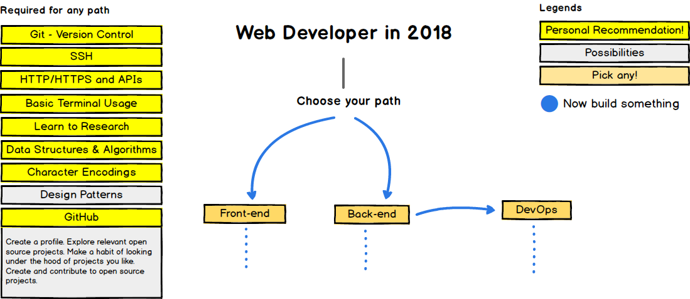

# Welcome to MT Dev
{: .no_toc .fs-9 }

Because learning to code in a classroom setting should not break the bank.
Here, you'll only pay after job placement. Plus, the curriculum is free
forever.
{: .fs-6 .fw-300 }

[Apply](mailto:pribylsnbits.com){: .btn .btn-primary .fs-5 .mb-4 .mb-md-0 .mr-2 }
[View it on GitHub](https://github.com/mtdev/mtdev.github.io){: .btn .btn-green .fs-5 .mb-4 .mb-md-0 }

---

## Table of contents
{: .no_toc .text-delta }

1. TOC
{:toc}

---

## Background

## Selecting a Track

### Front End

### Back End

## Get Started!
